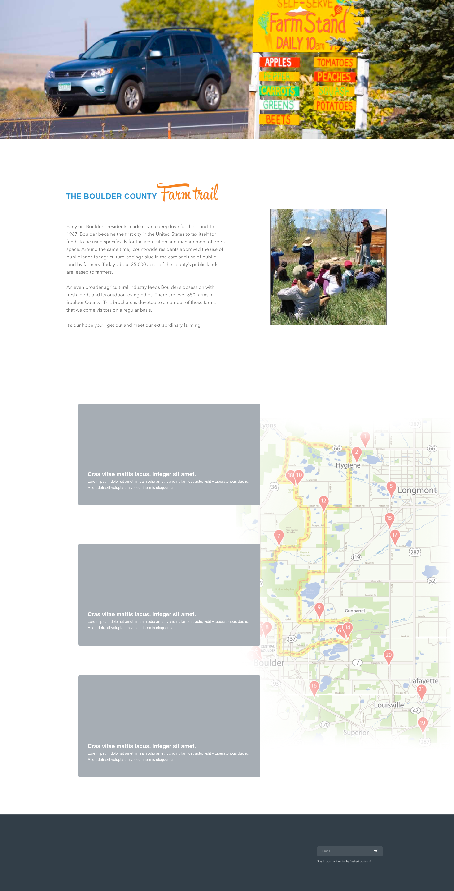
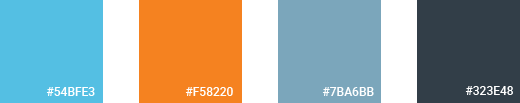

# Boulder Farm Map

## Wireframes

[Adobe XD Prototype](https://xd.adobe.com/view/18e8d5f3-a140-4fd9-6a92-4ad4d0b77ded-6ed9/?fullscreen&hints=off)

## Style Guide

Colors:

Fonts: Roboto & Nanito Sans

`<link href="https://fonts.googleapis.com/css?family=Nunito+Sans|Roboto:400,700" rel="stylesheet">`

## Planning

[Trello Board](https://trello.com/b/9XLW29BM/boulder-farm-map)

## Schema/ ERD for Database
[ERD for Boulder Farm Map](https://www.lucidchart.com/invitations/accept/2e079e10-6dfd-4e47-aaea-8644f7cb805c)

## Server Routes Plan
GET /api/farm *Retrieve all farms*

GET /api/farm_activities/:id *Retrieve a single farm's activities*

